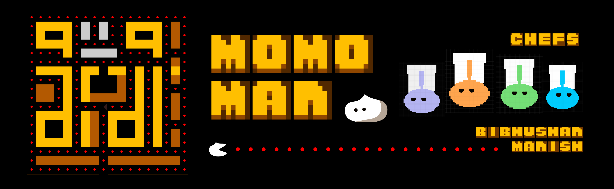

# MomoMan

  <!-- You can replace this with an actual screenshot of your game -->

## Table of Contents
- [Introduction](#introduction)
- [Features](#features)
- [Installation](#installation)
- [Usage](#usage)
- [Controls](#controls)
- [Future Improvements](#future-improvements)
- [Credits](#credits)

## Introduction

**MomoMan** is a 2D arcade game inspired by the classic Pac-Man, developed using Python and OpenGL. The project aims to recreate the nostalgic gameplay experience of Pac-Man while introducing modern enhancements. MomoMan features dynamic visual elements, engaging gameplay mechanics, and a custom grid layout.

## Features

- **Classic Arcade Gameplay**: Navigate the maze, collect points, and avoid enemy chefs.
- **Modern Enhancements**: Improved visuals using OpenGL.
- **Dynamic Elements**: A* Pathfinding for intelligent enemy movements.
- **Custom Grid Layout**: Unique maze design different from the original Pac-Man.

## Installation

### Prerequisites

- Python 3.x
- pip (Python package installer)

### Install Required Libraries

Before running the game, you need to install the following libraries:

```bash
pip install pygame PyOpenGL
```

## Usage

### Running the Game

1. **Clone the Repository**:
    ```bash
    git clone https://github.com/bibhushansaakha/MomoMan.git
    cd MomoMan
    ```

2. **Run the Game**:
    ```bash
    python3 game.py
    ```

## Controls

- **Arrow Keys**: Move MomoMan up, down, left, or right.
- **Esc**: Exit the game.

## Future Improvements

- **Enhanced AI**: Improve the behavior of enemy chefs.
- **Power-ups**: Introduce new power-ups for varied gameplay.
- **New Levels**: Add more levels with increasing difficulty.

## Credits

- **Developers**: Bibhushan Saakha, Manish Shivabhakti
